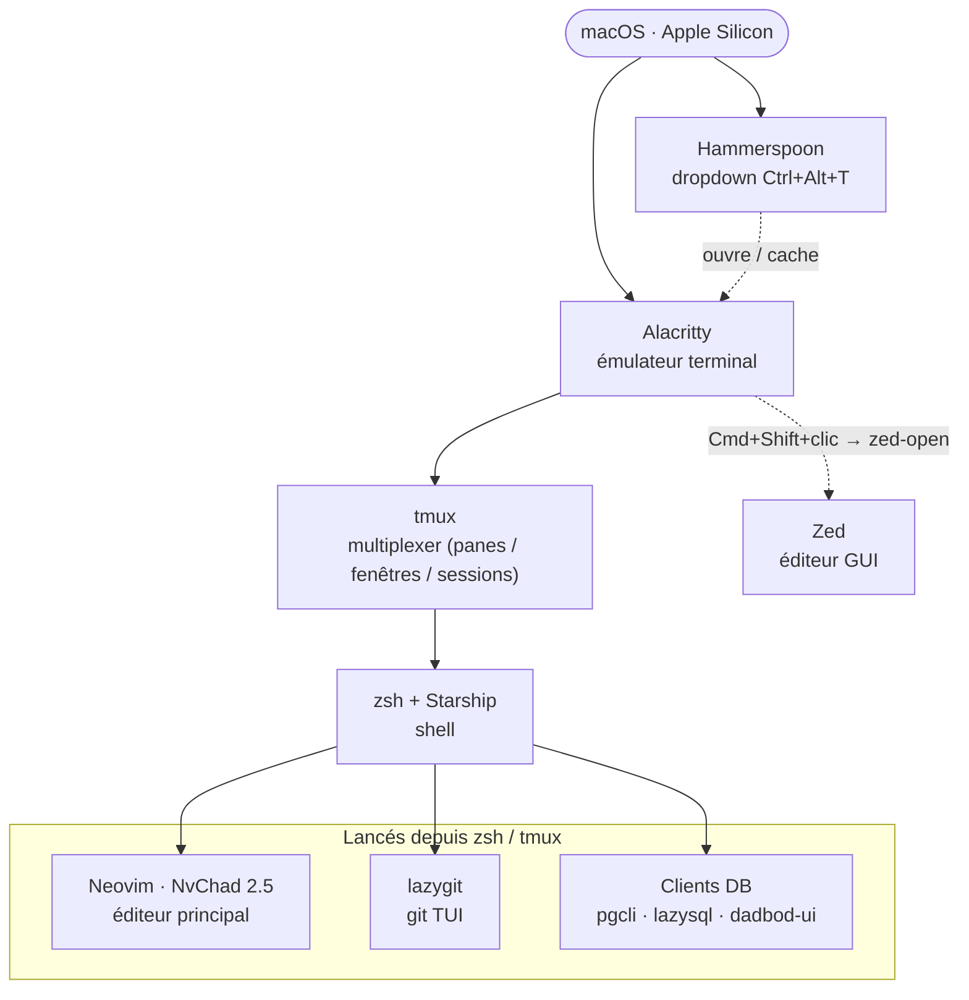
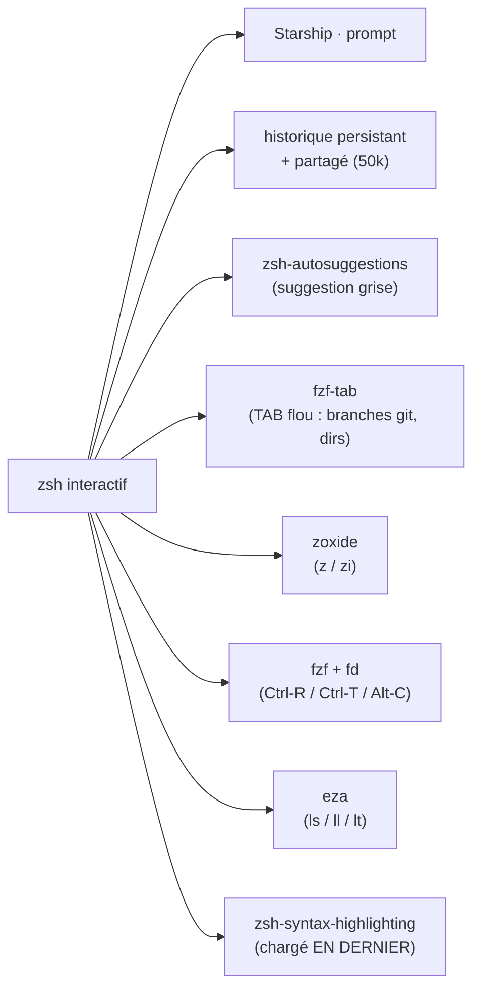
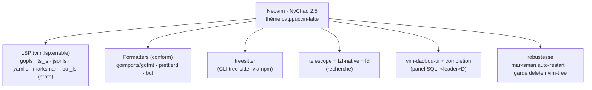
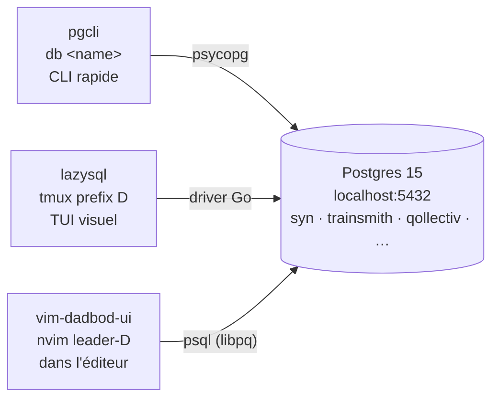
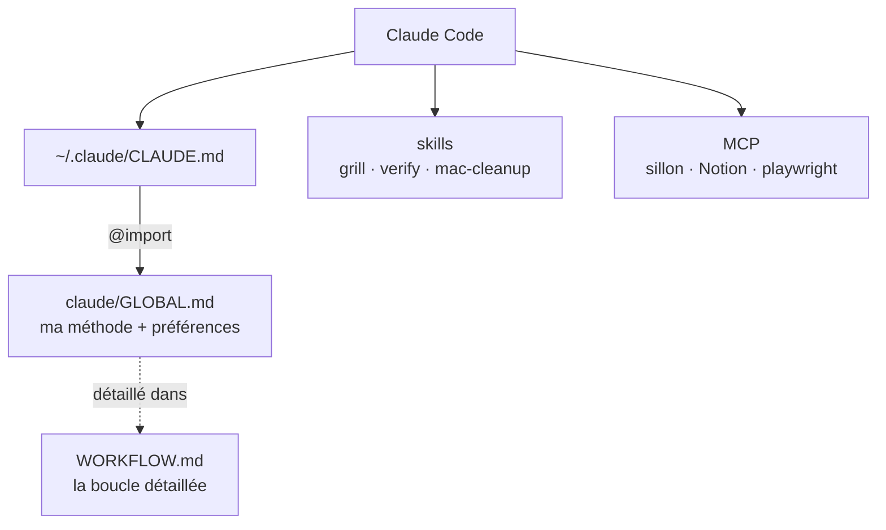
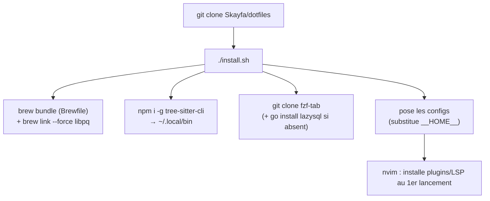

# Architecture du setup

Vue d'ensemble de **comment tout est implémenté et câblé** — du terminal jusqu'aux outils, à la couche Claude, et au repo qui versionne tout.

> Le **flux de travail** (méthode challenge → livraison fidèle) est documenté à part dans [`WORKFLOW.md`](WORKFLOW.md). Ce fichier-ci décrit l'**outillage**.

---

## 1. Le stack — les couches



**Principe** : macOS → Alacritty (terminal) → tmux (découpe l'écran, garde les sessions) → zsh (shell + prompt) → on lance nvim / lazygit / clients DB. Zed est l'éditeur GUI, ouvert depuis le terminal par un clic sur un chemin.

---

## 2. Câblage — qui déclenche quoi

| Geste                          | Couche                               | Effet                                                           |
| ------------------------------ | ------------------------------------ | --------------------------------------------------------------- |
| `Cmd+B`                        | Alacritty → tmux                     | envoie `Ctrl-b` (0x02) = **préfixe tmux**                       |
| `Shift+Entrée`                 | Alacritty                            | saut de ligne (saisie multi-ligne Claude Code)                  |
| `Cmd+Shift+clic` sur un chemin | Alacritty `[hints]` → `bin/zed-open` | ouvre le fichier dans **Zed** (résout `~`, le cwd du pane tmux) |
| `Cmd+Shift+clic` sur une URL   | Alacritty `[hints]`                  | ouvre dans le navigateur                                        |
| `Ctrl+Alt+T`                   | Hammerspoon                          | **dropdown** Alacritty (90% écran)                              |
| préfixe `g` / `G`              | tmux popup                           | **lazygit** (popup / fenêtre)                                   |
| préfixe `D`                    | tmux popup                           | **lazysql** (bases de données)                                  |
| préfixe `?`                    | tmux popup                           | aide-mémoire `tmux/cheatsheet.txt`                              |
| `⌥ ←/→/↑/↓`                    | tmux (sans préfixe)                  | naviguer entre panes                                            |
| `Shift ←/→`                    | tmux (sans préfixe)                  | fenêtre précédente / suivante                                   |
| `cheat` / `Ctrl-X ?`           | zsh                                  | aide-mémoire ligne de commande (`zsh/cheatsheet.txt`)           |
| `db <name>`                    | zsh                                  | **pgcli** sur une base Postgres locale                          |
| `z <bout>`                     | zsh (zoxide)                         | saute vers un dossier fréquent                                  |
| `<leader>D` / `:DBUI`          | nvim                                 | **vim-dadbod-ui** (panel SQL)                                   |
| `:Cheat` / `<espace>?`         | nvim                                 | aide-mémoire vim (`nvim/lua/cheat.lua`)                         |

---

## 3. Le shell (zsh) — ce qui est branché



Tout est dans [`zsh/plugins.zsh`](zsh/plugins.zsh), sourcé **en dernier** par `~/.zshrc`. oh-my-zsh est installé mais **dormant** (non activé). Détail des raccourcis d'édition : [`zsh/cheatsheet.txt`](zsh/cheatsheet.txt).

---

## 4. L'éditeur (Neovim / NvChad 2.5)



Fichiers clés : [`nvim/lua/plugins/init.lua`](nvim/lua/plugins/init.lua) (plugins), [`nvim/lua/configs/lspconfig.lua`](nvim/lua/configs/lspconfig.lua) (LSP + auto-restart marksman), [`nvim/lua/mappings.lua`](nvim/lua/mappings.lua) (`<leader>D`, garde nvim-tree), [`nvim/lua/chadrc.lua`](nvim/lua/chadrc.lua) (thème).

---

## 5. Accès base de données

Trois clients sur la **même** base locale — chacun pour un usage :



- **pgcli** → requêtes rapides en CLI (`db syn`, autocomplétion).
- **lazysql** → navigation visuelle façon lazygit (popup tmux).
- **dadbod-ui** → écrire/sauver des requêtes dans nvim (complétion des colonnes).
- Connexions par projet (ex. dolmen) = fichiers **locaux** (`~/Library/Application Support/lazysql/`, `~/.local/share/db_ui/`), **hors du repo public**.

---

## 6. La couche Claude (méthode + assistance)



`~/.claude/CLAUDE.md` importe [`claude/GLOBAL.md`](claude/GLOBAL.md) (chargé dans tous les projets). Les skills et settings vivent dans `claude/`. La boucle de travail : [`WORKFLOW.md`](WORKFLOW.md).

---

## 7. Structure du repo dotfiles

```
dotfiles/
├── install.sh            # pose tout le setup (brew bundle + substitution __HOME__ + clones/links)
├── Brewfile              # dépendances Homebrew (terminal, outils, LSP, clients DB…)
├── README.md             # comment installer / utiliser
├── WORKFLOW.md           # la MÉTHODE de dev (challenge → livraison fidèle)
├── ARCHITECTURE.md       # CE fichier (l'outillage)
├── alacritty/            # alacritty.toml (couleurs Everforest, hints→zed, Cmd+B→tmux)
├── hammerspoon/          # init.lua (dropdown)
├── tmux/                 # tmux.conf + cheatsheet.txt (popups g/G/D/?)
├── zsh/                  # plugins.zsh (UX) + aliases.zsh + cheatsheet.txt
├── starship/             # starship.toml (prompt)
├── lazygit/              # config.yml
├── nvim/                 # config NvChad 2.5 complète (lua/…)
├── bin/                  # ccw (worktrees) · zed-open (ouvre un chemin dans Zed)
└── claude/               # CLAUDE.md · GLOBAL.md · settings.json · skills/
```

---

## 8. Installation (reproductible)



`install.sh` est **idempotent** : il sauvegarde toute config existante en `*.bak.<date>` avant de la remplacer, et remplace le placeholder `__HOME__` par le vrai `$HOME` (pour la portabilité entre machines).

---

## 9. Versionné vs local

| Versionné (repo public)                                                                                       | Local (hors repo)                                                                             |
| ------------------------------------------------------------------------------------------------------------- | --------------------------------------------------------------------------------------------- |
| Tout l'outillage générique : alacritty, tmux, zsh, nvim, starship, lazygit, claude, bin, Brewfile, install.sh | Connexions DB d'un projet (`~/Library/Application Support/lazysql/`, `~/.local/share/db_ui/`) |
| La méthode (`GLOBAL.md`, skills)                                                                              | Tokens / secrets MCP (jamais commités)                                                        |
|                                                                                                               | `~/.zshrc`, `~/.tmux.conf`, `~/.config/nvim` (générés depuis le repo)                         |

**Règle** : le repo est **public** → uniquement du générique, jamais de secret. Les creds dev locaux (`user/password@localhost`) sont des defaults non-secrets.
