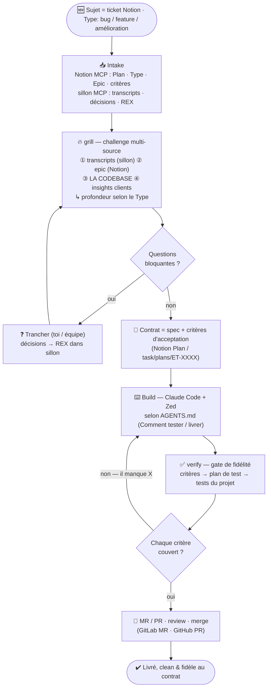

# Workflow de dev — challenge → livraison fidèle

Objectif : livrer **clean ET fidèle à ce qui a été vraiment demandé**. On **challenge** la demande avant de coder, et on **vérifie** que chaque critère d'acceptation est couvert avant de livrer.
Outils : Claude Code + Zed · **sillon** (MCP) · **Notion** (MCP) · skills **`grill`** / **`verify`** · lazygit.

## Les étapes en clair

| Étape       | Quoi                                                                                                                                   | Outil                           |
| ----------- | -------------------------------------------------------------------------------------------------------------------------------------- | ------------------------------- |
| **Intake**  | Lire le sujet : `Plan`, `Type`, `Epic`, critères · + contexte (transcripts, décisions, REX)                                            | Notion MCP · sillon MCP         |
| **Grill**   | Challenger la spec contre **4 sources** : transcripts · epic · **codebase** · insights → gaps + **critères d'acceptation** + questions | skill `grill`                   |
| **Contrat** | Spec + critères validés (le REX vit dans sillon)                                                                                       | Notion `Plan` / `task/plans`    |
| **Build**   | Coder selon les conventions du repo                                                                                                    | Claude Code + Zed · `AGENTS.md` |
| **Verify**  | Plan de test depuis les critères → tests projet → **couverture de chaque critère** (sinon on ne livre pas)                             | skill `verify`                  |
| **Ship**    | MR/PR → review → merge                                                                                                                 | lazygit · GitLab/GitHub         |

## Variantes

- **Par type** : `Bug` = grill léger (repro + cause + « corrigé quand… ») · `Amélioration` = moyen (avant → après) · `Feature` = profond (périmètre, edge cases, critères complets).
- **Perso** : même boucle, mais le « contrat » = ton idée qui se précise, et le **grill est itératif dans le temps**.
- **En parallèle** : plusieurs sujets en même temps via worktrees **`ccw`** (1 Claude isolé / branche) ou **Agent Teams** (plusieurs coéquipiers, 1 working tree). Voir le README (worktrees `ccw` + Agent Teams).

> Le principe tient en deux gardes : **rien ne se code sans critères d'acceptation** (grill), **rien ne se livre sans qu'ils soient couverts** (verify).
