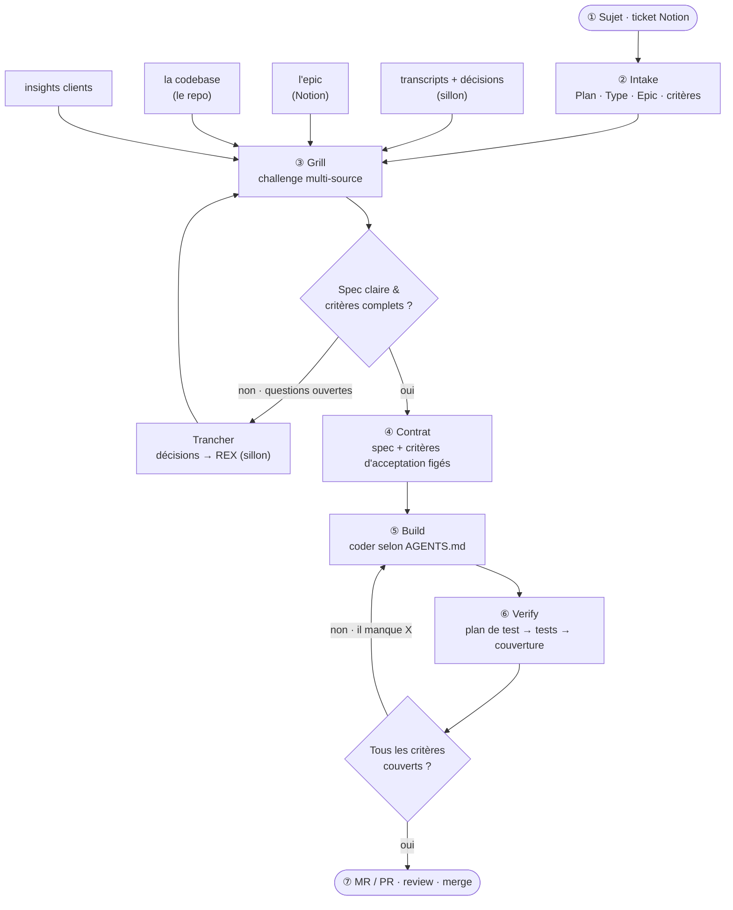

# Workflow de dev — challenge → livraison fidèle

**Règle en une phrase :** rien ne se code sans **critères d'acceptation** (étape ③), rien ne se livre sans qu'ils soient **tous couverts** (étape ⑥).

## Détail précis par étape

| #   | Étape       | Ce que je fais (précis)                                                                 | Outil                           | Entrée → Sortie                                 |
| --- | ----------- | --------------------------------------------------------------------------------------- | ------------------------------- | ----------------------------------------------- |
| ①   | **Sujet**   | Un ticket Notion à traiter (champ `Type` : bug / feature / amélioration)                | Notion                          | —                                               |
| ②   | **Intake**  | Lire `Plan`, `Type`, `Epic`, critères + le contexte capté                               | Notion MCP · sillon MCP         | ticket → compréhension du besoin                |
| ③   | **Grill**   | Challenger la spec contre **4 sources** : transcripts · epic · **codebase** · insights  | skill `grill`                   | compréhension → **gaps + critères + questions** |
| ④   | **Contrat** | Figer la spec + les critères d'acceptation (questions tranchées)                        | Notion `Plan` / `task/plans`    | questions résolues → **contrat testable**       |
| ⑤   | **Build**   | Coder selon les conventions du repo                                                     | Claude Code + Zed · `AGENTS.md` | contrat → code                                  |
| ⑥   | **Verify**  | Générer le plan de test depuis les critères → lancer les tests → couvrir chaque critère | skill `verify`                  | code → **matrice de couverture**                |
| ⑦   | **Ship**    | Ouvrir la MR/PR, review, merge                                                          | lazygit · GitLab / GitHub       | code couvert → mergé                            |

## Profondeur du grill selon le `Type`

| Type             | Grill                                                |
| ---------------- | ---------------------------------------------------- |
| **Bug**          | léger : repro + cause racine + « corrigé quand… »    |
| **Amélioration** | moyen : cadrer « avant → après » + critères du delta |
| **Feature**      | profond : périmètre, edge cases, critères complets   |

## Variantes

- **Perso** : même boucle, mais le « contrat » = ton idée qui se précise ; le grill est **itératif dans le temps**.
- **En parallèle** : plusieurs sujets à la fois via worktrees **`ccw`** (1 Claude isolé / branche) ou **Agent Teams** (plusieurs coéquipiers, 1 working tree) — voir le README.
