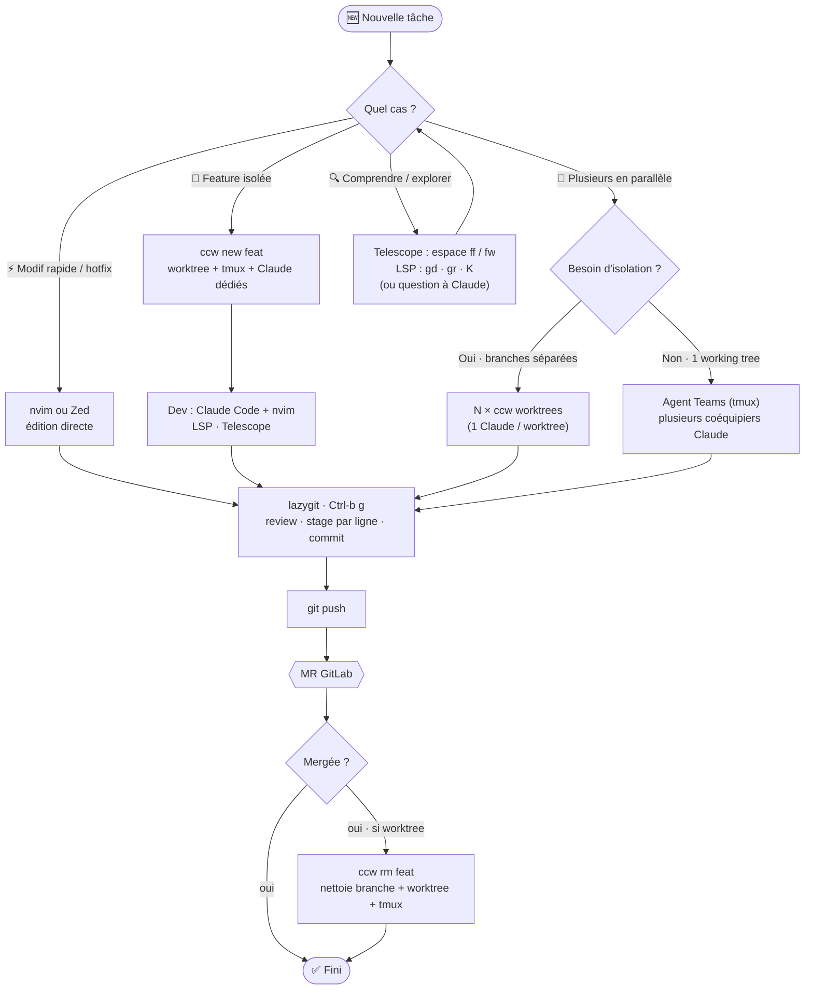

# Workflow de dev — selon les cas

Flux de travail avec mon setup (**Alacritty + tmux + nvim/Zed + lazygit + Claude Code**, monorepo **dolmen** Go/React/proto). Le schéma se lit de haut en bas : on entre par une tâche, on choisit le cas, tout converge sur la review → MR.

## Les cas en clair

| Cas                           | Quand                          | Outils / étapes                                                                                            |
| ----------------------------- | ------------------------------ | ---------------------------------------------------------------------------------------------------------- |
| ⚡ **Modif rapide / hotfix**  | un seul petit changement       | édite (nvim/Zed) → **lazygit** review+commit → push                                                        |
| 🌿 **Feature isolée**         | une feature dédiée             | `ccw new <feat>` (worktree + tmux + Claude) → dev → review → MR → après merge `ccw rm <feat>`              |
| 🔀 **Plusieurs en parallèle** | bosser sur 2+ choses à la fois | **branches séparées** → N `ccw` worktrees · **même working tree** → **Agent Teams** (`teammateMode: tmux`) |
| 🔍 **Comprendre / explorer**  | lire/naviguer le code          | Telescope (`espace ff`/`fw`), LSP (`gd`/`gr`/`K`), ou questions à Claude                                   |

**Convergence commune** : `lazygit` (review + commit) → `git push` → **MR GitLab** → merge → nettoyage du worktree si besoin.

> Schéma indicatif — adapte-le si tes cas réels diffèrent (je peux le régénérer).
